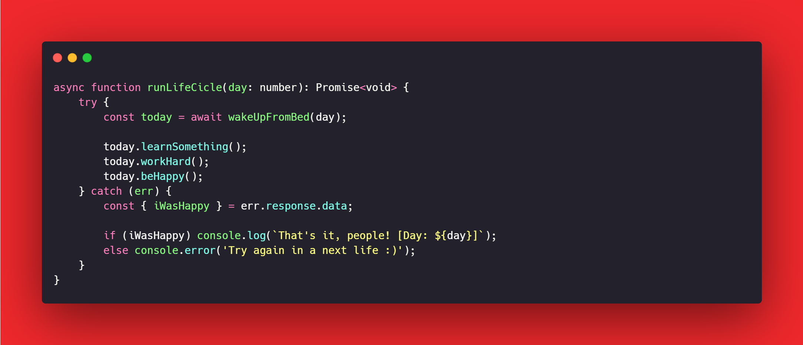

# :man_technologist: Lucas Bittencourt

## Olá! 

Meu nome é Lucas Bittencourt, Técnico em Desenvolvimento de Sistemas e apaixonado por Desenvolvimento.

- :office_worker: Full Stack Software Engineer at **Ênfase Labs**
- :blue_heart: Techs: React.js, React Native, Node.js, TypeScript, Docker, entre outras.
- :books: Estudando CI/CD com Jenkins, Docker e AWS :heart:

> :octocat: [lucasbittencourt.dev](https://lucasbittencourt.dev)

---

  
 <b> Quer saber mais sobre mim? </b> <i>(Clique aqui para expandir)</i> 

   

  

## Algumas Tecnologias

  
  
  
  
  
  
  
  
  
  
  
  
  
  
  
  
  
  
  
  
  
  
  
  
  
  ---
  
  

